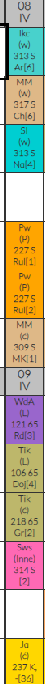
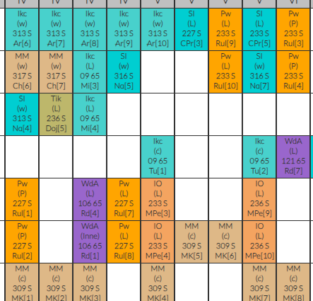

*żeby nie było, wiem, że to nie wygląda dobrze. To nie ma wyglądać dobrze tylko ilustrować ogólny koncept*

# Jaki rozwiązujemy problem? 
Mega obłożenie zajęciami i całym syfem do zrobienia:
- egzaminy 
- kolokwia
- sprawozdania (ha tfu)
- Bóg jeden wie(albo i nie) co jeszcze

  

(czyż watowscy planiści nie są super?)

co nasza aplikejszyn na to poradzi?
- zapewni progress bar - pozwoli widzieć postępy i efekty swoich działań co jest bardzo kluczowe jeśli chodzi o motywację
- przy kolektywnym udziale wielu osób (w obrębie jednej grupy dziekańskiej, bo tak jest wspólny plan) będzie pomagała
śledzić zadania do zrobienia
- dzięki efektywnemu planerowi czasu pozwoli **ujrzeć światełko w tunelu** co może być szczególnie istotne w pobliżu 
sesji, gdy obłożenie materiałem i zadaniami jest naprawdę duże
- planer będzie stanowił wsparcie psychiczne ponieważ zmniejszy ryzyko, że z powodu zbytniego obłożenia pracą przeciążony
student nie będzie w stanie koniec końców wziąć się za nic